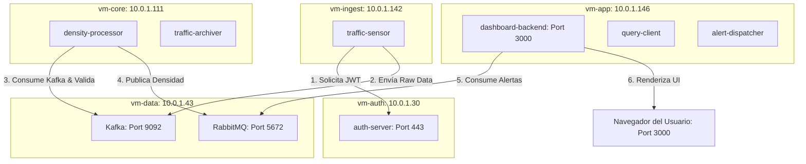

# SmartTraffic - Arquitectura Distribuida de Confianza Cero (Zero Trust)

Este proyecto implementa un sistema inteligente y distribuido de monitoreo de tráfico en tiempo real bajo un estricto modelo de **Confianza Cero (Zero Trust)** a nivel de red y aplicación. La arquitectura divide el sistema en **5 zonas de seguridad independientes (VMs)**, donde cada comunicación de red está bloqueada por defecto mediante **nftables** y requiere autenticación obligatoria mediante **JSON Web Tokens (JWT)**.

---

## 📐 Arquitectura de Zonas e Infraestructura AWS

La arquitectura de red está desplegada en una **VPC de AWS** con una subred privada y una subred pública para la visualización. Cada zona está aislada en una instancia EC2 independiente con las siguientes IPs privadas asignadas:



### Tabla de Redes y Seguridad AWS

| Instancia VM | IP Privada | Puertos Expuestos (Docker) | Servicio Principal | Acceso Permitido desde (Grupos de Seguridad) |
| :--- | :--- | :--- | :--- | :--- |
| **`vm-auth`** | `10.0.1.30` | `443` (HTTPS) | Auth Server (JWT issuer) | `vm-ingest`, `vm-core`, `vm-app` |
| **`vm-data`** | `10.0.1.43` | `9092` (Kafka) <br> `5672` (RabbitMQ) | Message Broker Core | **Kafka:** `vm-ingest`, `vm-core` <br> **RabbitMQ:** `vm-core`, `vm-app` |
| **`vm-ingest`**| `10.0.1.142`| Ninguno | `traffic-sensor` | Solo salida (Outbound) |
| **`vm-core`**  | `10.0.1.111`| Ninguno | `density-processor` & `traffic-archiver` | Solo salida (Outbound) |
| **`vm-app`**   | `10.0.1.146`| `3000` (HTTP/WS) | Dashboard & Clients | Cualquier origen (Público en puerto 3000) |

---

## 🛡️ Configuración de Seguridad en Hotspoting (nftables)

Cada VM tiene una política de firewall **DROP** en su cadena de entrada (`input`). Solo se permite loopback, conexiones establecidas (`ct state established,related accept`), SSH y los puertos estrictamente necesarios filtrando por IP de origen.

Los scripts de reglas se encuentran en la carpeta [infrastructure/firewall/](file:///c:/Users/XTHZC7/Desktop/UCC/Sexto_Semestre/sistemas_operativos/proyecto_final/smart-traffic-zero-trust/infrastructure/firewall).

### 📝 Resumen de Reglas Aplicadas:

#### 1. vm-auth.nft (Autenticación)
```nft
# Permitir 443 (Auth) únicamente de las IPs del clúster
define IP_INGEST = 10.0.1.142
define IP_CORE   = 10.0.1.111
define IP_APP    = 10.0.1.146

table inet filter {
    chain input {
        type filter hook input priority 0; policy drop;
        iif "lo" accept
        ct state established,related accept
        tcp dport 22 accept
        ip saddr { $IP_INGEST, $IP_CORE, $IP_APP } tcp dport 443 accept
    }
}
```

#### 2. vm-data.nft (Datos: Kafka & RabbitMQ)
```nft
define IP_INGEST = 10.0.1.142
define IP_CORE   = 10.0.1.111
define IP_APP    = 10.0.1.146

table inet filter {
    chain input {
        type filter hook input priority 0; policy drop;
        iif "lo" accept
        ct state established,related accept
        tcp dport 22 accept
        
        # Kafka exclusivo para Ingesta y Core
        ip saddr { $IP_INGEST, $IP_CORE } tcp dport 9092 accept
        
        # RabbitMQ exclusivo para Core y App
        ip saddr { $IP_CORE, $IP_APP } tcp dport 5672 accept
    }
}
```

#### 3. vm-app.nft (Aplicación y Dashboard)
```nft
table inet filter {
    chain input {
        type filter hook input priority 0; policy drop;
        iif "lo" accept
        ct state established,related accept
        tcp dport 22 accept
        
        # Abrir puerto del panel web para el exterior
        tcp dport 3000 accept
    }
}
```

#### 4. vm-ingest.nft & vm-core.nft (Aislamiento Total)
```nft
table inet filter {
    chain input {
        type filter hook input priority 0; policy drop;
        iif "lo" accept
        ct state established,related accept
        tcp dport 22 accept
    }
}
```

---

## 🚀 Guía de Despliegue Secuencial (Runbook de Estabilidad)

Para garantizar la correcta sincronización de tokens, enrutamientos de red y estabilidad del sistema distribuidor, **debes seguir estrictamente el siguiente orden de encendido**:

### Paso 1: Levantar e Inicializar `vm-auth`
El servidor de autenticación debe estar activo para firmar los tokens que requerirán todos los clientes.
```bash
cd ~/smart-traffic-zero-trust/infrastructure/deployment/vm-auth
docker compose up -d
sudo nft -f ../../firewall/vm-auth.nft
```

### Paso 2: Levantar `vm-data` (Brokers)
Los brokers deben inicializarse antes de que los clientes intenten conectarse.
```bash
cd ~/smart-traffic-zero-trust/infrastructure/deployment/vm-data
docker compose up -d
sudo nft -f ../../firewall/vm-data.nft
# CRÍTICO: Reconstruir rutas NAT de Docker sobre nftables
sudo systemctl restart docker
docker compose up -d
```

### Paso 3: Levantar `vm-core` (Procesamiento)
El procesador iniciará la lectura de eventos del topic de Kafka.
```bash
cd ~/smart-traffic-zero-trust/infrastructure/deployment/vm-core
docker compose up -d
sudo nft -f ../../firewall/vm-core.nft
sudo systemctl restart docker
docker compose up -d
```

### Paso 4: Levantar `vm-ingest` (Ingesta de Tráfico)
Los sensores comenzarán a emitir datos simulados hacia Kafka de inmediato.
```bash
cd ~/smart-traffic-zero-trust/infrastructure/deployment/vm-ingest
docker compose up -d
sudo nft -f ../../firewall/vm-ingest.nft
sudo systemctl restart docker
docker compose up -d
```

### Paso 5: Levantar `vm-app` (Panel Web y Clientes de Alertas)
Levantar la interfaz web accesible desde el navegador.
```bash
cd ~/smart-traffic-zero-trust/infrastructure/deployment/vm-app
docker compose up -d
sudo nft -f ../../firewall/vm-app.nft
sudo systemctl restart docker
docker compose up -d
```

---

## ⚠️ Resolución de Conflictos (Docker vs nftables)

> [!WARNING]
> En entornos Linux, Docker administra la redirección de puertos dinámicamente usando reglas en caliente sobre el kernel. Al aplicar un archivo `nftables` que contiene el comando `flush ruleset`, **se eliminan involuntariamente las tablas de enrutamiento y enmascaramiento de Docker**, rompiendo la comunicación de los contenedores.

### Síntoma:
* El contenedor está `Up` pero no puede recibir tráfico del exterior (`ERR_CONNECTION_REFUSED`).
* Errores en logs: `connect ECONNREFUSED 10.0.1.43:5672` o `iptables: No chain/target/match by that name`.

### Solución:
En la VM afectada, ejecuta estos comandos en orden para sincronizar las tablas de red en el kernel de Linux:
```bash
sudo systemctl restart docker
docker compose up -d
```

---

## 🧪 Pruebas de Validación y Auditoría (Cheatsheet)

### 1. Comprobar que las reglas de `nftables` están en caliente
```bash
sudo nft list ruleset
```
*(Verifica que la cadena `input` diga `policy drop;` y que los contadores de paquetes `counter packets X` incrementen).*

### 2. Comprobar Aislamiento (Zero Trust en acción)
* **Conexión permitida a Kafka desde `vm-ingest`:**
  ```bash
  nc -zv 10.0.1.43 9092
  # Salida: Connection to 10.0.1.43 9092 port [tcp/*] succeeded!
  ```
* **Conexión rechazada a Kafka desde `vm-app`:**
  ```bash
  nc -zv 10.0.1.43 9092
  # Salida: (Se queda colgado en timeout seguro)
  ```

### 3. Auditar fallos del sistema distribuido
Para verificar qué ocurre dentro de cada contenedor o si hay un crash de conexión:
```bash
docker logs -f <nombre_del_contenedor>
```
*(Ejemplo: `docker logs -f vm-app-dashboard-backend-1`)*
